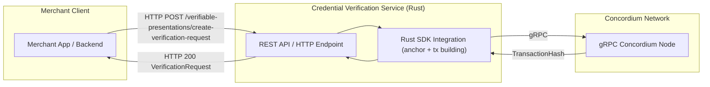

Architecture Overivew


Create Verification Request API:



Verify Presentation:

```mermaid
flowchart LR
    subgraph ClientSide["Merchant Client"]
        MUI["Merchant App / Backend"]
    end

    subgraph VerificationService["Credential Verification Service (Rust)"]
        API["REST API / HTTP Endpoint"]
        SDK["Rust SDK Integration 
            (Lookup verifiable request anchor tx, cryptographic verification & verifying presentation)"
        ]
    end

    subgraph Concordium["Concordium Network"]
        Node["gRPC Concordium Node"]
    end

    MUI -->|HTTP POST /verifiable-presentations/verify| API
    API --> SDK
    SDK -->|gRPC| Node
    Node -->|TransactionHash| SDK
    SDK --> API
    API -->|HTTP 200 VerifyPresentationResponse | MUI