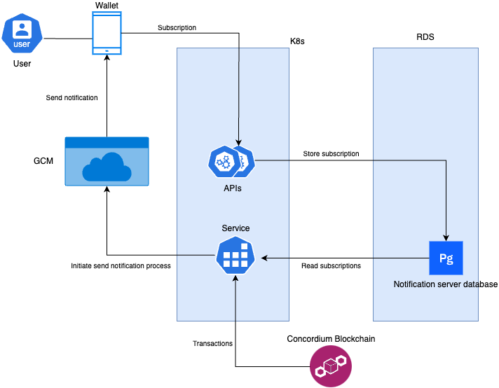

# Notification api

API to obtain information about particular account to device mappings and store them in a persistence layer.

## Component Interaction Diagram



# Notification service

Service indexing the CCD chain and given incoming transactions, emit a notification to the device
associated with the account that received the transaction.

This project uses Firebase Cloud Messaging (FCM) API V1 for the cross platform push notifications and is split into two binaries:

- `service` traversing finalized blocks on chain sending notifications to devices registered in the database.
- `api` providing a REST API for (de)registering devices in the database.

## Setting up for development

To be able to run the entire service locally, you first have to:

- Create a firebase project with a service account and then [create and export keys](https://firebase.google.com/docs/cloud-messaging/auth-server?authuser=0#provide-credentials-manually) for this account.
- Run PostgreSQL 16 server.

### Migrate the database schema

Database schema migrations are located in the `resources` directory and are prefixed incrementally.

Example of how to run a migration using `psql`:

```
psql <db-connection> < resources/000-schema.sql
```

### Configuring

The service is configured using environment variables and supports reading `.env` file from the current working directory.

An example of a `.env` which can be used as a template:

```
# Connection string for the postgresql database, used by both the service and the api.
NOTIFICATION_SERVER_DB_CONNECTION="host=localhost dbname=notification_server user=postgres password=example port=5432"
# Address and port to use for the API service.
NOTIFICATION_SERVER_LISTEN_ADDRESS="0.0.0.0:3030"
# Path to the Firebase SDK admin key export
NOTIFICATION_SERVER_GOOGLE_APPLICATION_CREDENTIALS_PATH=./secrets/google-credentials.json
# gRPC endpoint for the node, used by the service to observe the chain.
NOTIFICATION_SERVER_BACKEND_NODE=https://grpc.testnet.concordium.com:20000
```

to build and run the application during development use:

```shell
cargo run --bin <BINARY_NAME>
```

where `<BINARY_NAME>` is the name of the binary you want to run.

### Setup test FCM device and token

Assuming you have a FCM test project ready, you can export a configuration and use the small test web application in `test-device`. It simulates a device and allows for generating a FCM token and interacting with the API to (un)subscribe to notifications.

To export the firebase project config:

Get Your Firebase Config:

#. Go to your Firebase Console for your test project.
#. Navigate to Project settings (the gear icon next to "Project Overview").
#. Under the General tab, scroll down to the "Your apps" section.
#. Click on your Web app. If you don't have one, click "Add app" and choose the web icon.
#. Select the "Config" option for the Firebase SDK snippet.
#. Copy the `apiKey`, `authDomain`, `projectId`, `storageBucket`, `messagingSenderId`, and `appId`.
#. Crucially, also go to the "Cloud Messaging" tab in Project Settings. Under "Web configuration," find the "Key pair" section and copy the VAPID key.

Then paste the config into the placeholders in both files in `test-device` directory.
Paste the VAPID key into the `test-device/index.html`.

Serve the directory on some port on localhost. Note that it is crucial this is on localhost for service-workers to work in modern browsers.

Open the site and generate a token, this application should now receive notifications.

## API subscribe documentation

The subscription endpoint is idempotent.

All account-to-device mappings being registered under a single endpoint call will have the same preferences set.
Accounts is a list of base58 encoded account addresses.

At most 1000 accounts can be registered in one call and only 1000 accounts be queried at once.

Should conflicts occur upon subscription updates, then only the preferences are updated.

### Example subscribe request

```shell
curl -X PUT "http://localhost:3030/api/v1/subscription" \
    -H "Content-Type: application/json" \
    -d '{
        "preferences": ["cis2-tx", "ccd-tx"],
        "accounts": ["4FmiTW2L2AccyR9VjzsnpWFSAcohXWf7Vf797i36y526mqiEcp"],
        "device_token": "<device_token>"
    }'
```

### Example unsubscribe request
```shell
curl -X POST "http://localhost:3030/api/v1/unsubscribe" \
    -H "Content-Type: application/json" \
    -d '{
        "device_token": "<device_token>"
    }'
```
